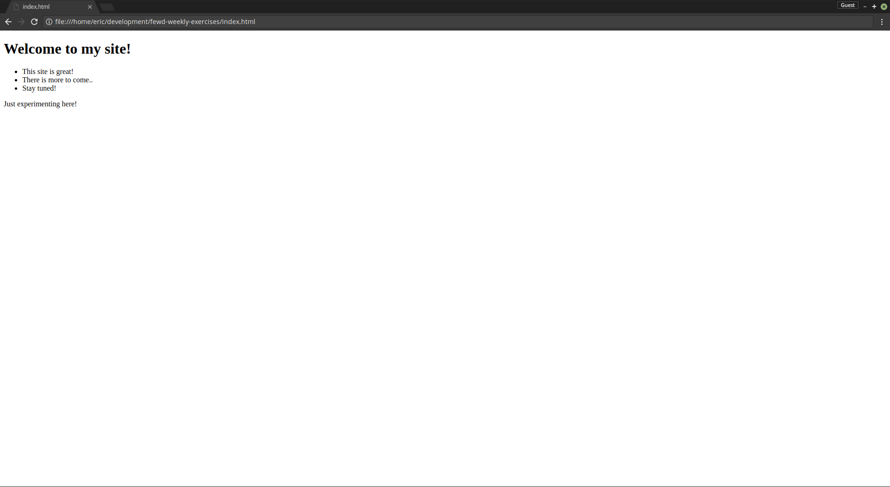

# Exercise one: Create a simple HTML page!
- Go here to try out exercise one: https://codepen.io/emcdow123/pen/aVBNry

- Feel free to complete the work in the Codepen, or try it on your local machine in your
favorite editor!

- Once complete, your project should look something like this:
